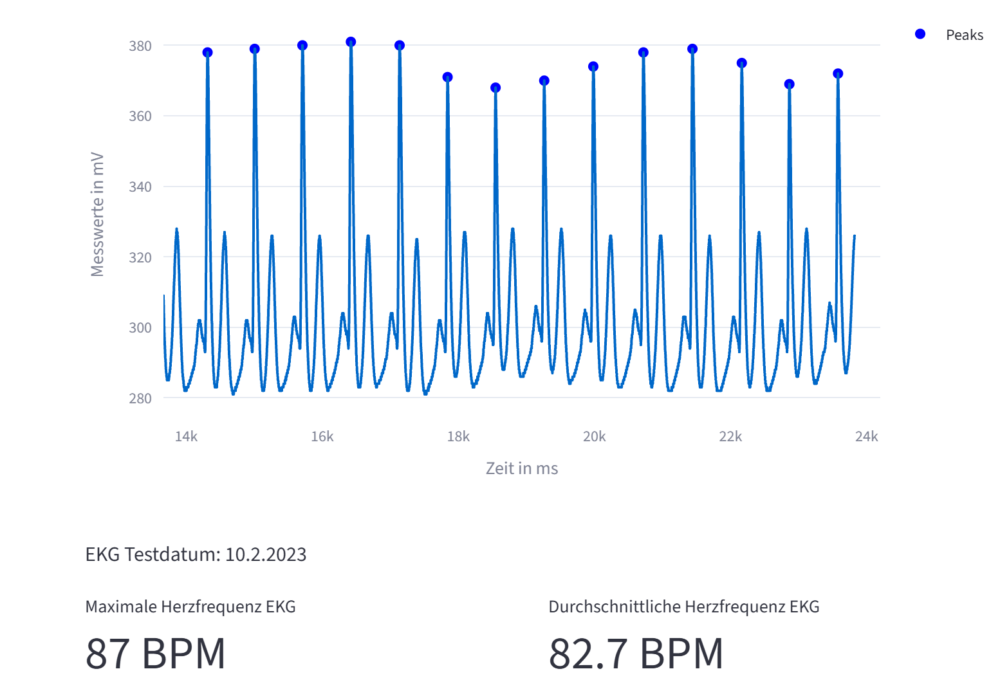

# Abgabe 4 - Dashboard mit Personen und EKG-Datenvisualisierung
Objektorientierte Anwendung zur Verwaltung von Personen und Visualisierung ihrer EKG-Daten mit Peak-Erkennung und Herzfrequenzberechnung.

---

## Übersicht
Interaktives Dashboard
Personen aus einer Datenbank anzeigen und EKG-Tests mit Visualisierung von Peaks und berechneter Herzfrequenz darstellen 

---

## Funktionen

| Komponente | Beschreibung |
|------------|------------|
|**Person-Klasse** | Verwaltung von Personendaten (ID, Name, Alter, Geschlecht) mit Methoden zur Berechnung von Alter und maximaler Herzfrequenz |
|**Ekgdata-Klasse** | Verarbeitung von EKG-Tests mit Peak-Erkennung, Herzfrequenzberechnung und Visualisierung |
|**Dashboard (Streamlit)** | Web-Oberfläche zur Auswahl von Personen und Anzeige ihrer EKG-Daten |

### Person-Klasse
- **Attribute**: `id`, `firstname`, `lastname`, `date_of_birth`, `gender`, `picture_path`, `ekg_tests`
- **Methoden**:
  - `load_by_id(id, database)`: Lädt eine Person aus Datenbank
  - `calc_age()`: Berechnet aktuelles Alter basierend auf Geburtsjahr
  - `calc_max_heart_rate()`: Berechnet maximale Herzfrequenz basierend auf Alter und Geschlecht
  - `load_person_data()`: Lädt alle Personen aus der JSON-Datenbank

### Ekgdata-Klasse
- **Attribute**: `id`, `date`, `result_link`, `peaks`, `heart_rate`
- **Methoden**:
  - `load_by_id(id, person_database)`: Lädt einen EKG-Test anhand der ID
  - `find_peaks()`: Erkennt Peaks in den EKG-Daten und speichert sie als Attribut
  - `estimate_hr()`: Berechnet die Herzfrequenz basierend auf erkannten Peaks
  - `plot_time_series()`: Erstellt Visualisierung der EKG-Daten mit markierten Peaks

---

## Start

Voraussetzungen: **Python 3.14+**, **uv**

**Mit uv:**
```bash
uv install
uv run streamlit run main.py
```

Anwendung unter `http://localhost:8501/` erreichbar (Port kann abweichen, siehe Terminal-Ausgabe)

Start über `uv run` durchzuführen, damit die Abhängigkeiten aus der Projektumgebung verwendet werden

---

## Projektstruktur

```
main.py                          # Dashboard
person.py                        # Person-Klasse
ekgdata.py                       # Ekgdata-Klasse
```

---

## Daten
ekg_data - EKG-Daten
person_db.json - Personen-Daten

### EKG-Datei-Struktur
EKG-Messdaten müssen als Text-Dateien vorliegen mit einer Spalte numerischer Messwerte (Spannung in mV), eine Messung pro Zeile.

---

## Abhängigkeiten

- **Streamlit** - Dashboard
- **Pandas** - Datenverarbeitung
- **NumPy** - Numerische Berechnungen
- **Plotly** - Visualisierung


---

## Autoren

- Luisa Grimm
- Clara Kerber



