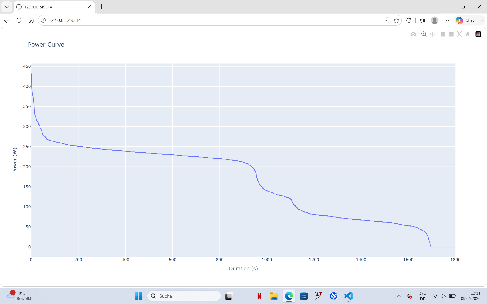

# Abgabe 3 - Advanced Power Curve
Analyse und Visualisierung von Leistungskurven aus Aktivitätsdaten mittels eigener Funktionen.

---

## Übersicht
Das Modul `advanced_power_curve` bietet Funktionen zur Verarbeitung und Analyse von Leistungsdaten (Power) aus Fitness-Aktivitäten. Es erstellt sogenannte Power Curves, die die maximale Durchschnittsleistung über verschiedene Zeitfenster hinweg darstellen.

---

## Funktionen

| Funktion | Beschreibung |
|----------|------------|
|**`read_data`** | Liest Aktivitätsdaten aus `activity.csv` und erstellt Zeitspalte |
|**`find_best_power`** | Berechnet maximale Durchschnittsleistung für ein bestimmtes Zeitfenster |
|**`find_all_windows`** | Analysiert mehrere Zeitfenster gleichzeitig |
|**`make_power_curve`** | Erstellt DataFrame mit Leistungskurve und generiert interaktiven Plot mit Plotly |

### `make_power_curve()` - Hauptfunktion
- **Input**: Leistungsdaten (Series, DataFrame oder Array)
- **Output**: DataFrame und Figure
- **Funktionalität**: 
  - Sortiert Leistungswerte absteigend
  - Erstellt Zeitachse basierend auf `time_step_seconds`
  - Visualisiert die Power Curve mit Plotly

---

## Installation und Start

Voraussetzungen: **Python 3.14+**, **uv**

**Mit uv:**
```bash
uv install
uv run python advanced_powercurve_main.py
```

Das Skript liest automatisch `data/activities/activity.csv`, berechnet die Power Curve und zeigt das Ergebnis an.

---

## Projektstruktur

```
advanced_power_curve.py           # Hauptmodul mit Funktionen
advanced_powercurve_main.py       # Beispiel-Anwendung
data/
  └── activities/
      └── activity.csv           # Eingabedaten
```

---

## Datenformat

`activity.csv` muss mindestens folgende Spalte enthalten:

- **`PowerOriginal`** - Leistung in Watt (W)


---

## Abhängigkeiten

- **Pandas** - Datenmanipulation und -analyse
- **NumPy** - Numerische Berechnungen
- **Plotly** - Interaktive Visualisierung


---

## Autoren

- Clara Kerber
- Luisa Grimm

